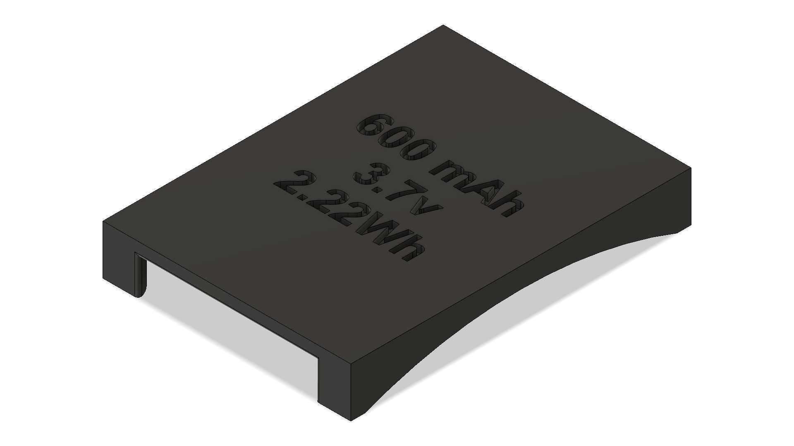
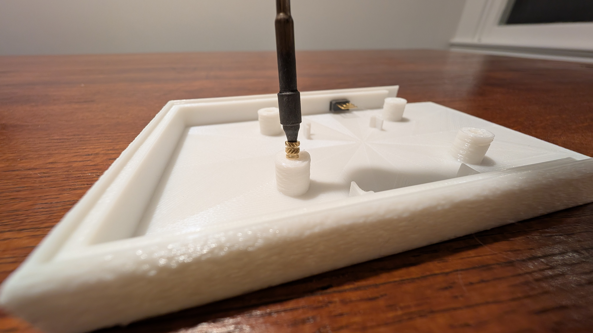
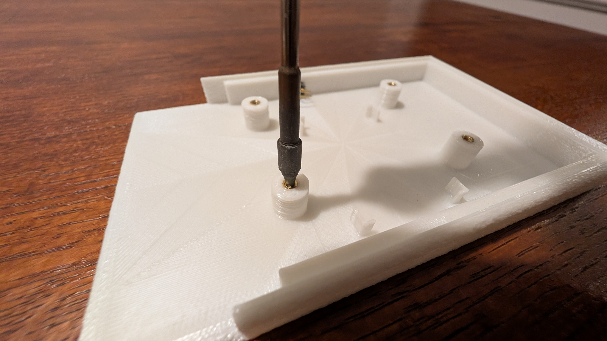
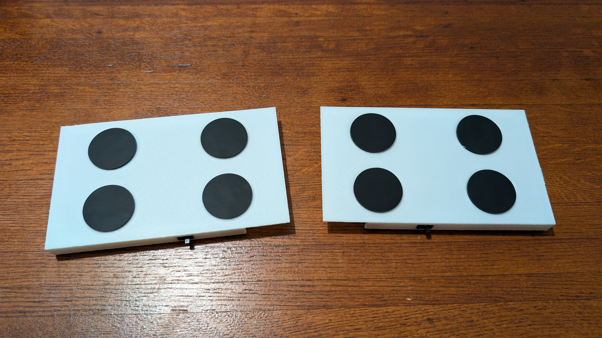
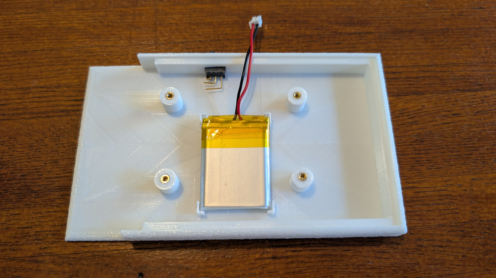

# BIBA40 Build Guide

> **Official Assembly Instructions for the BIBA40 Keyboard**
> Repository: [https://github.com/danbiba/zmk-config-biba40](https://github.com/danbiba/zmk-config-biba40)

---

## Introduction

The **BIBA40** is a compact, split, wireless keyboard powered by ZMK firmware and two microcontrollers. This guide provides a clear, step-by-step process for building the latest V2 revision, including 3D printing, assembly, flashing, and pairing.

---

## PCB Fabrication

### Custom Printed PCB

If you're looking to have one of these PCBs custom make, use the files in the **`production`** folder to upload for manufacturing. The PCBs for the BIBA40 were produced by [PCBWay](https://www.pcbway.com/). Their fabrication process ensured a reliable build and helped bring this project to life. The **V2** boards were manufactured and delivered in under one week.

---

## Bill of Materials (BOM)

### Electronics

* 2 × BIBA40 **V2** PCBs (left and right) https://Bibakeyboards.com or order from PCBway
* 2 × Microcontrollers (e.g., **nice!nano v2** or **Supermini NRF52840**) with matching headers https://tinyurl.com/4uzn3k5p
* 48 × 1N4148W surface-mount diodes https://tinyurl.com/u4n7be6v
* 48 × Mechanical switches (5-pin recommended)
* 2 × 3.7V 600mAh LiPo batteries with JST-PH 2-pin connectors (one per half) https://tinyurl.com/yckcn2nw
* 2 × JST PH-2 to bare wire cables (battery to PCB connection) https://tinyurl.com/3m6w2ezd
* 2 × Power slide switches (one per half)
* Hook-up wire for power switch leads (approximately 4" per half)

### Case and Hardware

* 3D-printed components:

  * **Case ×2** (mirror one for left/right)
       
  * **Battery Cover ×2**
    
  * **Mini Plate ×2**
    
* Heat-set threaded inserts: **2-56 × 4.0** https://tinyurl.com/3tsjmrzd
* Machine screws (2-56 to match inserts) https://tinyurl.com/4tx2c6br
* Rubber adhesive feet https://tinyurl.com/4bz7kvkp
* Kapton or heat tape for wire strain relief https://tinyurl.com/54bem9f9

### Tools

* Soldering iron with fine tip, solder, and flux
* Hot-air rework station (optional) or iron reflow for SMD diodes
* Heat-set insert tool or temperature-controlled iron
* Tweezers
* Side cutters
* Precision screwdriver
* Multimeter for continuity checks
* 3D printer and filament

> **Safety Note:** Always disconnect batteries during soldering. Follow LiPo safety procedures and use ESD-safe handling for all electronics.

---

## Step 1: 3D Print the Case

1. Choose a filament color.
2. Slice and print the following:

   * Case ×2 *(mirror one if printing separately)*
   * Battery Cover ×2
   * Mini Plate ×2
3. If using a **pre-sliced file**, insert the power switch **during the print** when prompted by your printer. Ensure it fits and moves smoothly.

> **Tip:** Print a small calibration part first to confirm switch tolerances before committing to the full print.

---

## Step 2: Prepare and Assemble the Case

1. Heat-press **2-56 × 4.0** threaded inserts into the mounting slots.
   
   
   
3. Verify that each insert is aligned **perfectly vertical (90°)** relative to the side walls.

   
   
5. Apply **rubberized feet** to the bottom of each case.

   

7. Straighten **power switch leads**, if necessary.
8. Secure the switch using a soldering iron or a **small dab of super glue**.
9. Solder two **4-inch wires** to the switch, leaving bare ends for the PCB connection.
10. Insert the **battery** into its slot, route cables upward, and attach the **battery cover**.
    
    
    

---

## Step 3: Flash the Microcontrollers

> These steps assume a UF2-capable microcontroller. Adjust as needed for other bootloaders.

1. Connect one microcontroller via USB.
2. If the computer does not detect it, short **RST** and **GND** twice to enter bootloader mode.
3. Drag the correct **ZMK firmware UF2** file (left or right) onto the mounted drive. The device will automatically disconnect when flashing completes.
4. Label the microcontroller **Left** or **Right**.
5. Repeat for the second half.

**Image placeholders:**
`docs/img/bootloader.jpg`
`docs/img/uf2-drag-drop.jpg`

---

## Step 4: Assemble the PCB

1. **Pre-tin** one pad of each diode footprint.
2. **Pre-tin** both battery and switch pads.
3. Align each diode with correct **polarity** and reflow the pre-tinned pad. Hold until secure.
4. Repeat for all **48 diodes**.
5. Solder the second pad of each diode and inspect for cold joints or solder bridges.
6. Reflow as needed.
7. Solder the **battery connector cable** to the battery pads (**red = +**, **black = −**).
8. Use Kapton tape to secure the cable, routing it **away from the microcontroller**.
9. Fit the **headers** using the microcontroller as a spacer. Tack-solder one or two pins on each side.
10. Remove the microcontroller and complete header soldering.
11. Reinstall and solder the microcontroller carefully.
12. Insert switches into the **mini plate** to confirm alignment; some edge switches may require manual support.
13. Flip the board and solder the switch pins, ensuring switches sit **flush** to the PCB.
14. Add and solder any remaining switches.

**Image placeholders:**
`docs/img/diode-polarity.jpg`
`docs/img/header-alignment.jpg`
`docs/img/switch-soldering.jpg`

---

## Step 5: Final Assembly

1. Match each PCB with its corresponding case and place it **face down**.
2. Solder the **switch wires** to the two **Switch** pads on the bottom of the PCB.
3. Connect the **battery** to the PCB’s battery plug.
4. Use Kapton tape to organize wires, avoiding excessive strain.
5. Flip the PCB into position, aligning the screw holes.
6. Insert screws through the **mini plate** and into the **threaded inserts**. Tighten gently.
7. Install **keycaps**.

**Image placeholders:**
`docs/img/wire-routing.jpg`
`docs/img/case-closeup.jpg`

---

## Step 6: Power Up and Pairing

1. Turn on the **left half**.
2. Turn on the **right half**. The halves will automatically pair.
3. On your device, connect to the Bluetooth keyboard named **“BIBA40.”**

> If pairing fails, power-cycle both halves and retry. Only power one left and one right half during initial pairing.

---

## Troubleshooting

| Issue                            | Possible Cause                            | Solution                                           |
| -------------------------------- | ----------------------------------------- | -------------------------------------------------- |
| **Microcontroller not detected** | Not in bootloader mode                    | Short **RST** to **GND** twice and retry.          |
| **Keys not responding**          | Incorrect diode orientation or cold joint | Verify polarity, reflow joints.                    |
| **No power on one half**         | Incorrect battery polarity or wiring      | Check connections and switch orientation.          |
| **Bluetooth pairing issues**     | Cached pairing data                       | Remove device from Bluetooth settings and re-pair. |

> For advanced troubleshooting, refer to the [ZMK documentation](https://zmk.dev/docs/).
