# Biba Ortho Split 40% W

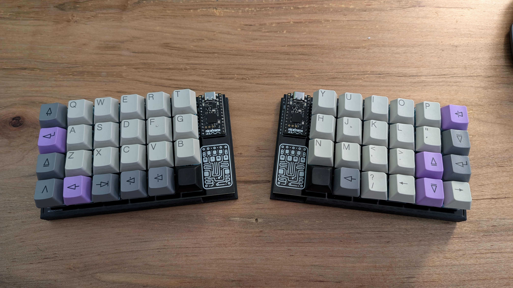
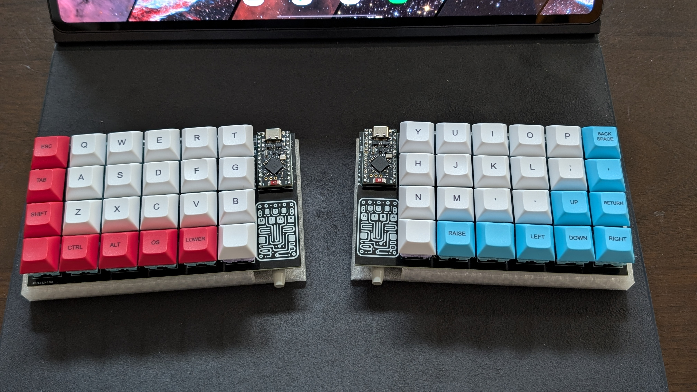
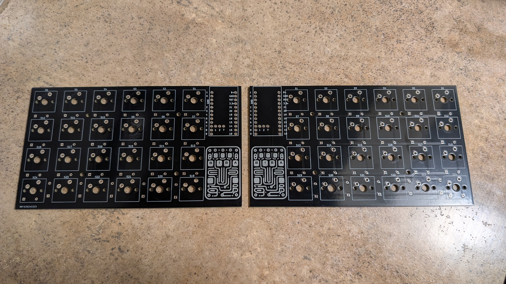
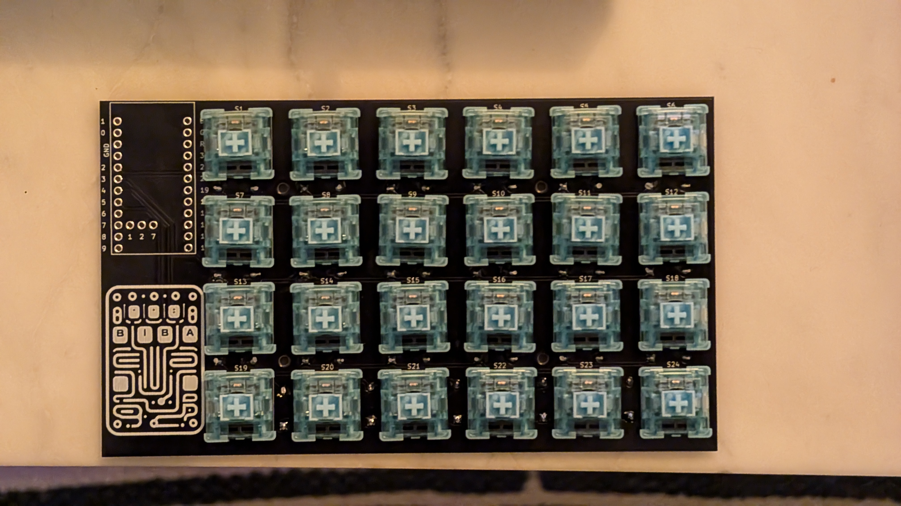
A 40% Split Ortholiner wireless keyboard powered by ZMK.

* Keyboard Maintainer: [Daniel Biba](https://github.com/danbiba)
* Hardware Supported: nice!nano v2, Supermini NRF52840
* Hardware Availability: 3D Printable

## Keymap
### Default Layer

### Lower Layer
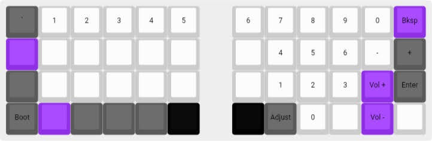
### Raise Layer
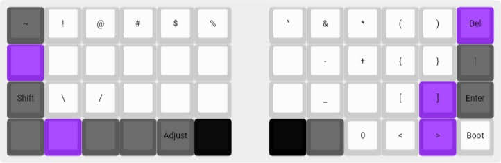
### Adjust Layer
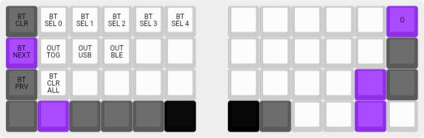
### Function Layer
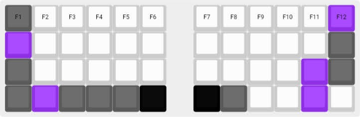

## Setup
Clone the repository located at https://github.com/danbiba/zmk-config-biba40

Compile the firmware using Github actions. This will produce 3 files:

* biba40_left-nice_nano_v2-zmk.uf2
* biba40_right-nice_nano_v2-zmk.uf2
* settings_reset-nice_nano_v2-zmk.uf2

## Bootloader

Enter the bootloader in 3 ways:

* Lower + 0,3 (for the left board)
* Raise + 5,3 (for the right board)
* Short out pins RST and GND on the nice!nano v2

## Bill of Materials
* Diodes (x48): https://a.co/d/eJoqduj (These diodes are used with v1 of the PCB)

  *or*
  
* SMD Diodes (x48): https://www.amazon.com/dp/B079KJX5J9?ref=ppx_yo2ov_dt_b_fed_asin_title (These diodes are used with v2 of the PCB)
  
* nice!nano v2 Boards (x2): https://typeractive.xyz/products/nice-nano?srsltid=AfmBOorYy64nuOajRfCriYDKuNkl67lxsEgmVNestwJp75MjIY7lx9oo

*or*

* Supermini NRF52840 (x2):
https://shorturl.at/Ixrgx
    
* Switches (Akko V3 Creamy Blue Pro x48):
https://a.co/d/eVtw93V

* Lithium Battery 110mAh (x2)
https://typeractive.xyz/products/lithium-battery-110mah?pr_prod_strat=pinned&pr_rec_id=a04cb0af0&pr_rec_pid=7488871366887&pr_ref_pid=7488867991783&pr_seq=uniform

* Custom Printed PCB: use the files in the production folder to upload for manufacturing. The PCBs for the Biba40  were produced by PCBWay (https://www.pcbway.com/). Their fabrication process ensured a reliable build and helped bring this project to life. I ordered the v2 version of the board, and got them built and delivered shockingly fast (under 1 week)
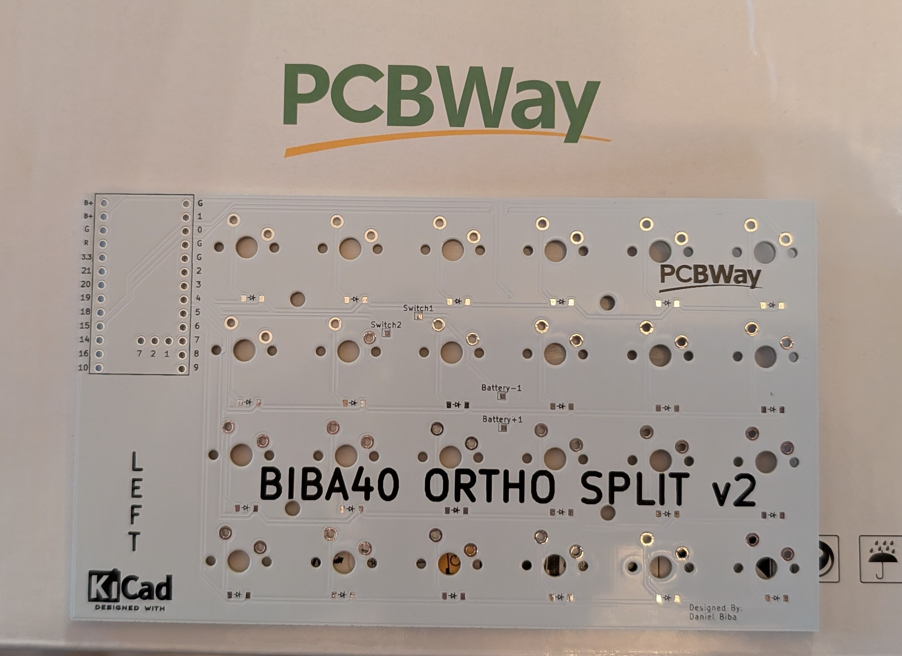

* Rubber Foot Pads
    

## Assembly

* Import the STL files in the Case folder to your favorite slicer. You can print one side of the case, then simply mirror the file in your slicer for the other side. My keyboard was printed on an Ender 3 v3 SE and I used the fuzzy skin setting for a nice finish.

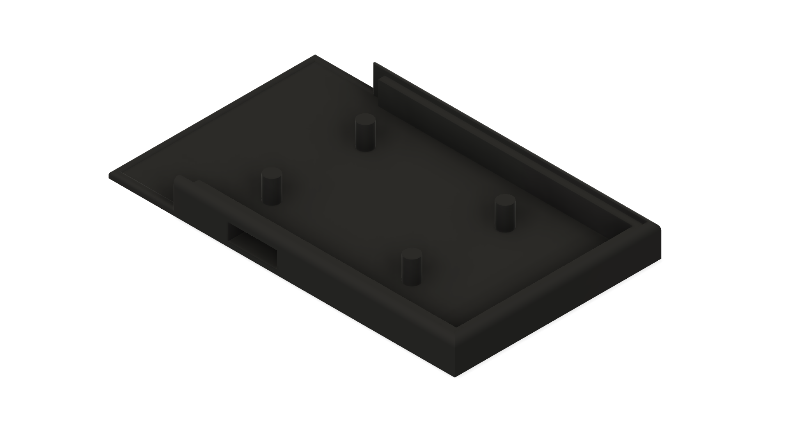

### PCB Version 1 (Through Hole Diodes)

* If using the v1 PCB and through hole diodes Gently bend each diode on both sides so that they can smoothly insert into the holes marked with the diode symbol. Orientation is important with the diodes for the board to operate properly. Insert the legs of each diode into their holes and bend the legs on the other side so that the diodes don’t slide out. The diodes should be located on the bottom of the boards, with the legs sticking up.
* When all the diodes are inserted, flip the board and solder all the legs for the diodes. Trim the legs with side cutters. There is one diode in the bottom left and right respectively that is located within the footprint of the switch it’s connected to, so it may require a more flush cut than the others. Be careful not to cut it too flush so that you ruin the solder connection.
  
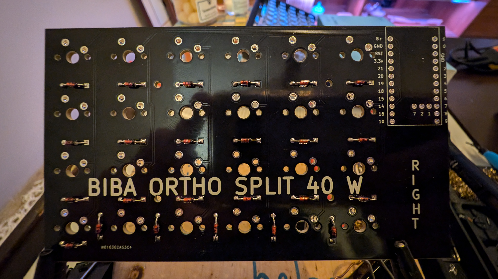

### PCB Version 2 (SMD Diodes)

* If using the V2 PCB, simple align and solder the diodes to the provided pads.
  
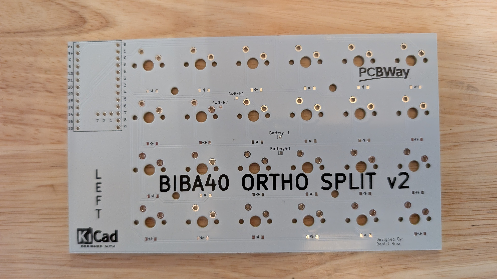

### Switches

* Carefully line the switches up with the holes on the board. You can use 3 pin or 5 pin switches. 5 pin will be more steady in the absence of a plate. Solder each switch until both boards have all the switches soldered in place.

### Controller

* Connect the nice!nano v2/Supermini NRF52840 controller to the Biba40 shields with the provided headers. The controller will be on the same side as the switches. Solder the header to the shield and the controller to the headers.

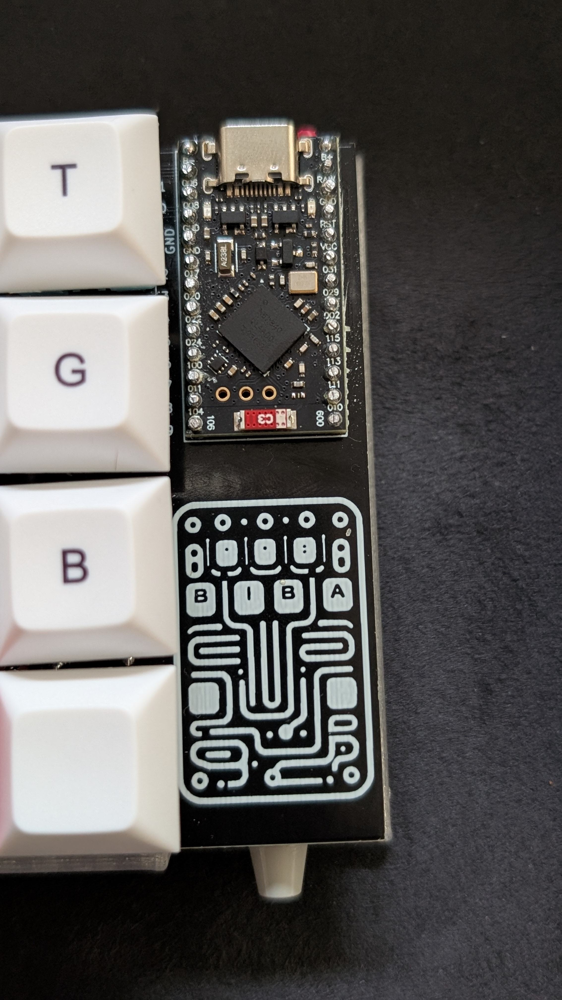

* Plug in each nice!nano v2/Supermini NRF52840 to a computer with a USB C cable, from the factory they should show up as USB drives on your computer. Flash each controller with the corresponding firmware file (left to left, right to right) by dragging the file into the connected drive. It will flash and then disconnect.  You can short out the GND and RST pins twice if the USB drive isn’t seen by your PC. The included settings_reset-nice_nano_v2-zmk.uf2 file can be used to reset the settings on either board (see ZMK docs for more info)

### Battery

* You can solder the battery to the GND and B+ pins on the bottom of the shield directly for the v1 PCB, on the V2 PCB there are pads for the battery as well as pads for the inline switch.

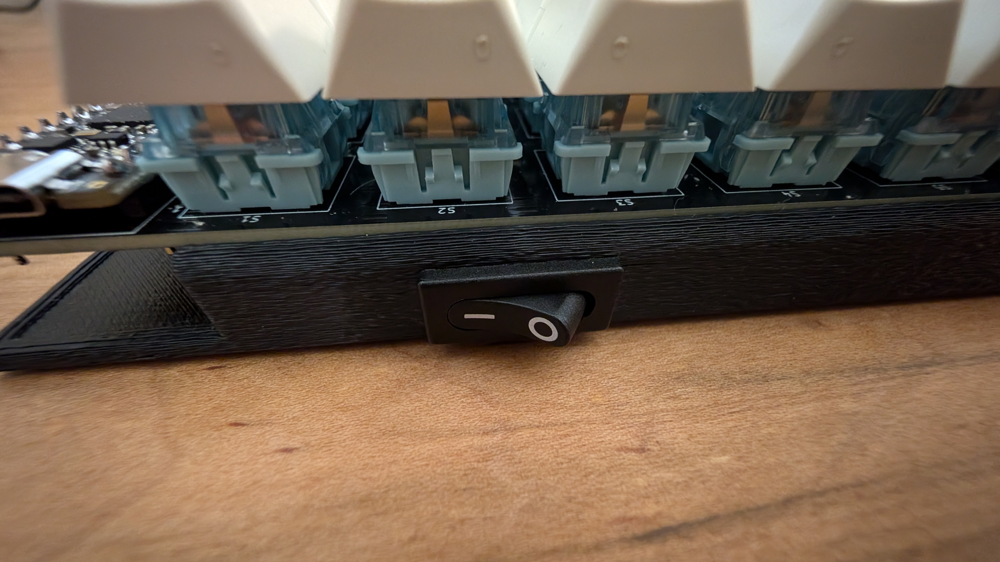
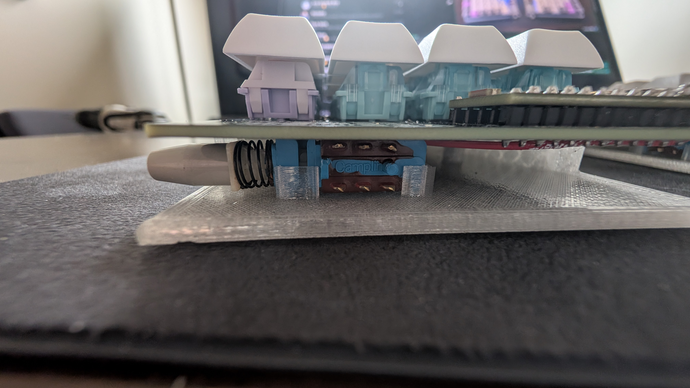

* The Biba40 shield will snap into the 3d printed cases. If you want you can secure it with screws into the included studs via the holes on the board or a little glue.

* The keymap is designed to mimic another board that I frequently use, but you can always alter the keymap file to your liking, recompile the firmware and reflash the files.
* Pair the Biba40 to your computer or device and start typing.

